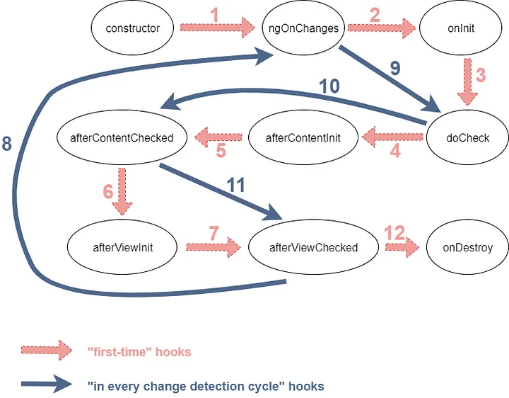

# Note de Recherche

## Pourquoi utiliser angular
1. Il simplifie le processus de construction d'interfaces utilisateur web et hautement interactives.
2. Il donne de nombreuses fonctionnalités utiles ainsi que des règles et des concepts pour faciliter ce processus.
   - Écrir du code déclarative (en opposer de code impérative)
   - La séparation en composant (.ts, .html, .css, .spec.ts)
   - La POO
   - Utilisation de typescript
   - 
## Installation 
 npm install -g @angular/cli  --> (pour spécifier la version : npm install -g @angular/cli@14) --> npm install -g @angular/cli@latest

## création de projet
ng new nom-du-projet

## Extension Vscode:
Angular Language Service
Angular Essentials (Version 18)

## Création de composant
ng generate component 

## Installation de tailwindcss
npm install -D tailwindcss postcss autoprefixer
npx tailwindcss init -p

## Standalone Components
Ce sont des composants qui ne sont déclarés dans aucun NgModule.
Ils sont autonomes et peuvent être utilisés n'importe où dans votre application sans
qu'il soit nécessaire d'importer un NgModule.

- Avantage: Charger nécessairement le composant (fully lazy-loaded)

## Bindings
- Interpolation
- Property Binding
- Attribute Binding
- Class Binding
- Style Binding
- Event Binding
- Two-Way Binding

## Séquence de la méthode Lifecycle
- ngOnChanges : Appeler lorsque @Input change (not on object and array)
- ngOnInit : Appeler une seule fois dans le cycle de vie du composant, (après le ngOnChange)
- ngDoCheck: Lorsqu'un changement est détecté, Angular commence par le composant racine puis les childs. ngDoCheck est invoqué lorsqu'on vérifie les childs
- ngAfterContentInit:  Appelé après que le contenu projeté (via <ng-content>) a été initialisé.
- ngAfterContentChecked: Ce crochet sera appelé après ngAfterContentInit et après chaque ngDoCheck.
- ngAfterViewInit: 
- ngAfterViewChecked: 
- ngOnDestroy: Appelé avant qu'Angular ne supprime le modèle de composant du DOM

## PIPE
Angular passe les données en entrée au pipe et utilise le résultat retourné par le pipe pour mettre à jour la vue.
